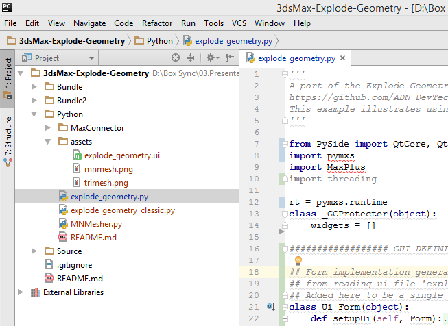
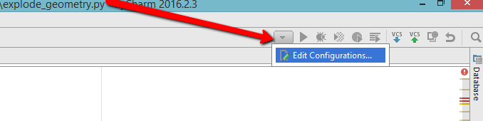
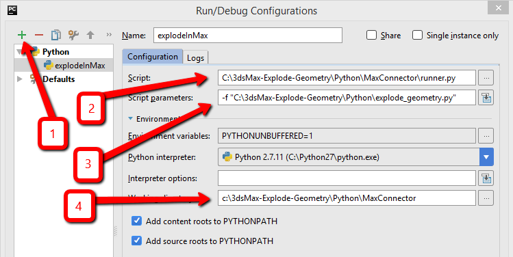
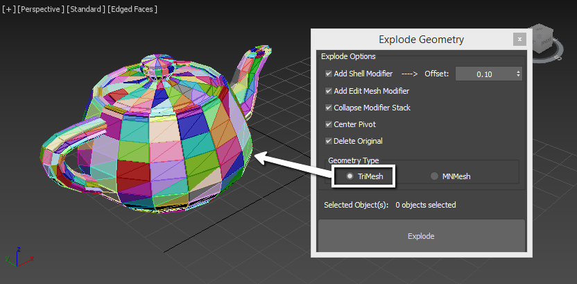
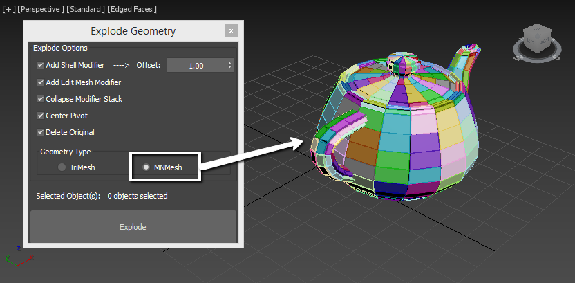

##  Explode Geometry - Python implementation

This is a Python port of the ***3ds Max Explode Geometry plug-in***, available in 2 version:

-  **explode_geometry_classic** - *TriMesh* decomposition only - requires the MaxPlus Python feature, first introduced in 3ds Max 2014 Extension 1
-  **explode_geometry_2017** - *TriMesh* and *MNMesh* decomposition - requires the Maxplus and pymxs feature, both requiring 3ds Max 2017

Both versions were implemented as a single file, to avoid problems with paths, however the QDesigner file (*.ui), used for *explode_geometry_2017* is also available in the assets folder, and can be either useed to generate python file through:
```$ pyside-uic explode_geometry.ui -o exp_gui.py```
or use the newest feature of 3ds Max and use the *pysideuic* module along with *MaxPlus* to [load the ui file directly](http://help.autodesk.com/view/3DSMAX/2017/ENU/?guid=__developer_what_s_new_in_3ds_max_python_api_what_s_new_in_the_3ds_max_2017_p_html).

### Setup:

You can load the provided script directly or make use of included MaxConnector (component of [YCDIVFX_MaxPlus repo](https://github.com/ycdivfx/YCDIVFX_MaxPlus), which is very helpful for using with externals IDEs (like PyCharm). 

## Example of use with PyCharm:
Load the project into PyCharm:


Select to create a new Run configuration


In new window:

1. create new configuration;
2. in script path put the path to ```MaxConnector\runner.py```
3. in script parameter add ```-f``` and path to the explode geometry script
4. make sure that the Working directory is the same as folder path to ```runner.py```



### Usage:
After running it either directly in 3ds Max or through PyCharm as stated above, you can choose from 2 decompositions types: TriMesh or MNMesh

